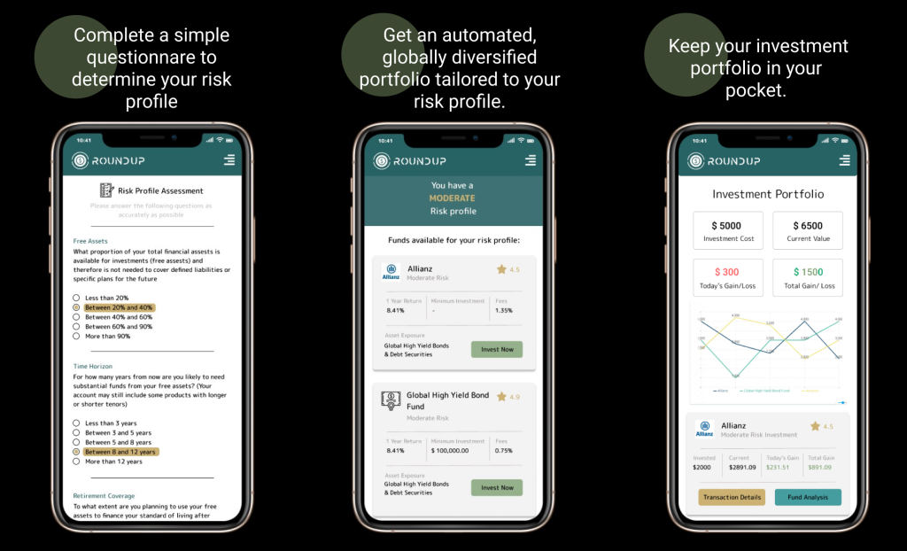

```{=html}
<main class="design-page">
  <section class="design-hero">
    <div class="design-hero-copy">
      <p class="design-kicker">Product design</p>
      <h1>Interfaces shaped around clarity, trust, and useful action.</h1>
      <p>
        Selected UI/UX work across financial tools, civic platforms, energy experiences, and bias-awareness products.
      </p>
      <div class="design-tags" aria-label="Design focus areas">
        <span>Mobile UX</span>
        <span>Product Strategy</span>
        <span>Figma</span>
        <span>Dashboards</span>
      </div>
    </div>

    <a class="design-hero-card" href="posts/design_portfolio/round_up.html">
      
      <div>
        <span>Featured case study</span>
        <strong>RoundUp Finance App</strong>
      </div>
    </a>
  </section>

  <section class="design-showcase" aria-label="Featured design projects">
    <a class="design-case design-case-large" href="posts/design_portfolio/round_up.html">
      <div class="design-case-media">
        
      </div>
      <div class="design-case-copy">
        <div class="design-meta">
          <span>Fintech</span>
          <span>Mobile App</span>
          <span>2023</span>
        </div>
        <h2>RoundUp: Finance Tracking App</h2>
        <p>A mobile saving and investing concept that helps users build micro-savings through rounded-up purchases and low-friction investment flows.</p>
      </div>
    </a>

    <a class="design-case" href="posts/design_portfolio/c4t.html">
      <div class="design-case-copy">
        <div class="design-meta">
          <span>Energy</span>
          <span>Mobile UX</span>
          <span>2025</span>
        </div>
        <h2>C4T Energy Mobile App</h2>
        <p>Clean mobile experience direction for an energy-focused product, emphasizing simple flows and clear user decisions.</p>
      </div>
    </a>

    <a class="design-case" href="posts/design_portfolio/mindful.html">
      <div class="design-case-copy">
        <div class="design-meta">
          <span>Social Impact</span>
          <span>UX Research</span>
          <span>2023</span>
        </div>
        <h2>MindScope: Mitigating Unconscious Bias</h2>
        <p>Design exploration for a bias-awareness mobile experience that makes reflection, learning, and behavior change feel approachable.</p>
      </div>
    </a>
  </section>

  <section class="design-process" aria-label="Design process">
    <div class="section-heading">
      <p class="design-kicker">How I design</p>
      <h2>From ambiguous brief to usable flow</h2>
    </div>

    <div class="process-grid">
      <div class="process-card">
        <span>01</span>
        <h3>Frame the problem</h3>
        <p>Clarify user needs, business goals, constraints, and success metrics before jumping into screens.</p>
      </div>
      <div class="process-card">
        <span>02</span>
        <h3>Map the flow</h3>
        <p>Translate messy requirements into journey maps, task paths, content hierarchy, and interaction states.</p>
      </div>
      <div class="process-card">
        <span>03</span>
        <h3>Prototype and refine</h3>
        <p>Build visual systems and interactive prototypes, then iterate with feedback from users and stakeholders.</p>
      </div>
    </div>
  </section>
</main>
```
