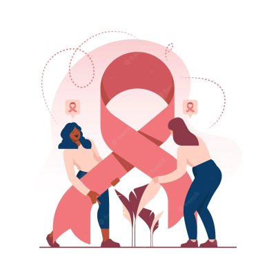
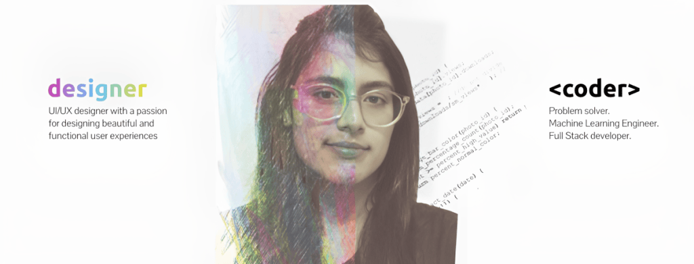

{.avatar-xl .center alt="Aarushi Nema" fig-cap=""}

<div class="hero-title">Hi! I am <span class="accent">Aarushi</span></div>

<div class="center">
  <span class="tagline-lg typewriter-line">
    <span class="tw-text"></span><span class="caret"></span>
  </span>
  
</div>

<div class="blurb">
I’m a Data Science & AI graduate from NTU Singapore with experience across data engineering, ML systems and scalable products. I enjoy bridging research with practical outcomes, and designing solutions that are simple and useful.
</div>

<div class="btn-row center">
[Get In Touch](mailto:aarushi.nema02@gmail.com){.btn .btn-light .btn-sm}
[Download CV](/data/nema_aarushi_resume.pdf){.btn .btn-outline-light .btn-sm}
</div>

## Tools of the Trade

```{=html}
<div class="skills-layout">
  <div class="skills-row">
    <div class="skill-card">
      <div class="skill-icon ai-icon"></div>
      <h3>Data / AI</h3>
      <p>I specialize in building scalable data pipelines and intelligent systems, combining machine learning, deep learning, and responsible AI research. My experience spans data migration with PySpark and Airflow at Hyundai, ETL automation and RPA development at Infineon, and academic projects including conversational recommender systems (PRICAI 2025 accepted), value-aligned LLMs (NeurIPS 2025 submission), and a top 3.2% Kaggle solution using LightGBM ensembles.</p>
      <div class="tech-stack-label">Tech stack:</div>
      <div class="tech-stack">
        <span class="tech-pill">Python</span>
        <span class="tech-pill">PyTorch</span>
        <span class="tech-pill">TensorFlow</span>
        <span class="tech-pill">Scikit-Learn</span>
        <span class="tech-pill">PySpark</span>
        <span class="tech-pill">Hadoop</span>
        <span class="tech-pill">SQL</span>
        <span class="tech-pill">Tableau</span>
        <span class="tech-pill">Pandas</span>
      </div>
    </div>

    <div class="skill-card">
      <div class="skill-icon dev-icon"></div>
      <h3>Web/Mobile dev</h3>
      <p>I have built full-stack applications that integrate APIs, databases, and modern frameworks to deliver seamless user experiences. My work includes Flask APIs for Hadoop data retrieval at Hyundai, a React–Flask–SQL chatbot at Infineon, a React Native mobile app with Node.js and MongoDB Atlas under Credit Suisse mentorship, and NTU Student Union portals redesigned with ReactJS, Tailwind, and Django APIs to improve usability and performance.</p>
      <div class="tech-stack-label">Tech stack:</div>
      <div class="tech-stack">
        <span class="tech-pill">Flask</span>
        <span class="tech-pill">Django</span>
        <span class="tech-pill">ReactJS</span>
        <span class="tech-pill">React Native</span>
        <span class="tech-pill">NodeJS</span>
        <span class="tech-pill">MongoDB</span>
        <span class="tech-pill">JavaScript</span>
        <span class="tech-pill">Quarto</span>
      </div>
    </div>

  </div>

  <div class="skills-row">
     <div class="skill-card">
      <div class="skill-icon automation-icon"></div>
      <h3>CI/CD & Automation</h3>
      <p>I have developed feature-rich Android applications using Kotlin and Java, with hands-on experience in Android Studio and a solid understanding of app lifecycle management.</p>
      <div class="tech-stack-label">Tech stack:</div>
      <div class="tech-stack">
        <span class="tech-pill">Kotlin</span>
        <span class="tech-pill">Java</span>
        <span class="tech-pill">Flutter</span>
        <span class="tech-pill">Android Studio</span>
        <span class="tech-pill">Firebase</span>
      </div>
    </div>

     <div class="skill-card">
      <div class="skill-icon uiux-icon"></div>
      <h3>UI/UX</h3>
      <p>I have developed feature-rich Android applications using Kotlin and Java, with hands-on experience in Android Studio and a solid understanding of app lifecycle management.</p>
      <div class="tech-stack-label">Tech stack:</div>
      <div class="tech-stack">
        <span class="tech-pill">Kotlin</span>
        <span class="tech-pill">Java</span>
        <span class="tech-pill">Flutter</span>
        <span class="tech-pill">Android Studio</span>
        <span class="tech-pill">Firebase</span>
      </div>
    </div>
  </div>
</div>
```
## Experience

````{=html}
<div class="experience-container">
  <div class="experience-card">
    <div class="experience-header">
      <div class="experience-title">
        <h3>Data Platform Intern</h3>
        <p class="company">Hyundai Motor Group Innovation Centre Singapore</p>
      </div>
      <div class="experience-date">
        <span class="date-badge">May 2024 – Aug 2024</span>
      </div>
    </div>
    <div class="experience-content">
      <ul class="experience-list">
        <li>Engineered and optimized scalable data migration pipelines from Relational DBMS (PostgreSQL and Tibero) to Hadoop Data Lake using Python, PySpark, Apache Airflow, and Bash scripting</li>
        <li>Developed RESTful APIs using Flask and PySpark to enable dynamic data retrieval and filtering from Hadoop Data Lake across multiple data formats</li>
        <li>Designed and implemented a dynamic data synchronization pipeline integrating multiple database systems to PostgreSQL using PySpark, ensuring data consistency and reliability</li>
        <li>Created technical documentation for data pipelines</li>
      </ul>
    </div>
  </div>

  <div class="experience-card">
    <div class="experience-header">
      <div class="experience-title">
        <h3>Software Development (Data Application) Intern</h3>
        <p class="company">Infineon Technologies</p>
      </div>
      <div class="experience-date">
        <span class="date-badge">May 2023 – Dec 2023</span>
      </div>
    </div>
    <div class="experience-content">
      <ul class="experience-list">
        <li>Collaborated closely with stakeholders and product engineers to identify data challenges and translate business requirements into robust data engineering solutions, resulting in enhanced Tableau dashboards and optimized data pipelines with new feature integrations</li>
        <li>Developed Python scripts to automate extraction, transformation, and loading (ETL) process for production yield records into a SQL database using Jenkins, meeting stakeholder specifications, and creating an automated email notification system based on the data</li>
        <li>Spearheaded development of a centralized Robotic Process Automation (RPA) solution from scratch utilizing UiPath and Python, resulting in an 90% reduction in human intervention across four critical software tools</li>
        <li>Designed and implemented a Confluence-based chatbot using React, Flask, and SQL, significantly reducing time spent searching for and navigating through various software tools</li>
        <li>Presented technical projects and dashboards to cross-functional teams, translating complex data workflows into business impact</li>
      </ul>
    </div>
  </div>
</div>
````

## Projects

````{=html}
<div class="projects-carousel">
  <div class="projects-container">
    <div class="project-card">
      <div class="project-image">
        
      </div>
      <div class="project-content">
        <h3>Power of SVM</h3>
        <p>Small demo building a linear SVM for classification with clear visualizations.</p>
        <a href="posts/machine_learning_projects/index.qmd" class="project-link">Read more</a>
      </div>
    </div>
    
    <div class="project-card">
      <div class="project-image">
        
      </div>
      <div class="project-content">
        <h3>CSS Magic</h3>
        <p>Design exploration: building crisp, modern components with minimal CSS.</p>
        <a href="design_portfolio.qmd" class="project-link">See design</a>
      </div>
    </div>
    
    <div class="project-card">
      <div class="project-image">
        
      </div>
      <div class="project-content">
        <h3>Round Up App</h3>
        <p>UI/UX design for a financial app that helps users save money through round-up features.</p>
        <a href="posts/design_portfolio/round_up.qmd" class="project-link">View project</a>
      </div>
    </div>
    
    <div class="project-card">
      <div class="project-image">
        
      </div>
      <div class="project-content">
        <h3>AI Agent Core</h3>
        <p>Building a comprehensive customer support agent using Amazon BedRock AgentCore.</p>
        <a href="posts/machine_learning_projects/AgentCore.qmd" class="project-link">Read more</a>
      </div>
    </div>
    
    <div class="project-card">
      <div class="project-image">
        
      </div>
      <div class="project-content">
        <h3>Art Portfolio</h3>
        <p>Collection of digital sketches and illustrations showcasing creative design skills.</p>
        <a href="art.qmd" class="project-link">View gallery</a>
      </div>
    </div>
    
    <div class="project-card">
      <div class="project-image">
        
      </div>
      <div class="project-content">
        <h3>Portfolio Website</h3>
        <p>Personal portfolio website built with Quarto, featuring responsive design and modern aesthetics.</p>
        <a href="index.qmd" class="project-link">Explore site</a>
      </div>
    </div>
  </div>
</div>
````

### Contact

- ✉️ [aarushi.nema02@gmail.com](mailto:aarushi.nema02@gmail.com)  
- 🔗 [LinkedIn](https://www.linkedin.com/in/aarushi-nema-64a006185/)  
- 🐙 [GitHub](https://github.com/aarushi-nema)

```{=html}
<script>
  document.addEventListener('DOMContentLoaded', function(){
    var container = document.querySelector('.typewriter-line');
    var textNode = document.querySelector('.typewriter-line .tw-text');
    if(!container || !textNode) return;

    // Plain text phrases to avoid HTML flicker while typing
    var phrasesPlain = [
      'Turning Data Into Decisions',
      'AI Into Action',
      'UI/UX Into Unforgettable Experiences'
    ];
    // Accent mappings applied only when holding at full text
    function accentify(text){
      return text
        .replace(/^Turning Data/, 'Turning <span class="accent">Data</span>')
        .replace(/^AI/, '<span class="accent">AI</span>')
        .replace(/^UI\/UX/, '<span class="accent">UI/UX</span>');
    }

    // Stabilize width to prevent layout shift when empty
    var maxLen = phrasesPlain.reduce((m,s)=> Math.max(m, s.length), 0);
    container.style.minWidth = 'ch'.replace('ch', maxLen);
    container.style.display = 'inline-block';

    var i=0, j=0, deleting=false;
    function setText(slice){ textNode.textContent = slice; }
    function setFullWithAccent(str){ container.querySelector('.tw-text').innerHTML = accentify(str); }

    function step(){
      var current = phrasesPlain[i];
      if(!deleting){
        j++;
        setText(current.slice(0,j));
        if(j === current.length){
          setFullWithAccent(current);
          deleting = true; 
          return setTimeout(step, 900);
        }
        return setTimeout(step, 55);
      } else {
        j--;
        setText(current.slice(0,j));
        if(j === 0){ deleting=false; i=(i+1)%phrasesPlain.length; return setTimeout(step, 450); }
        return setTimeout(step, 35);
      }
    }
    step();
  });
</script>
```
