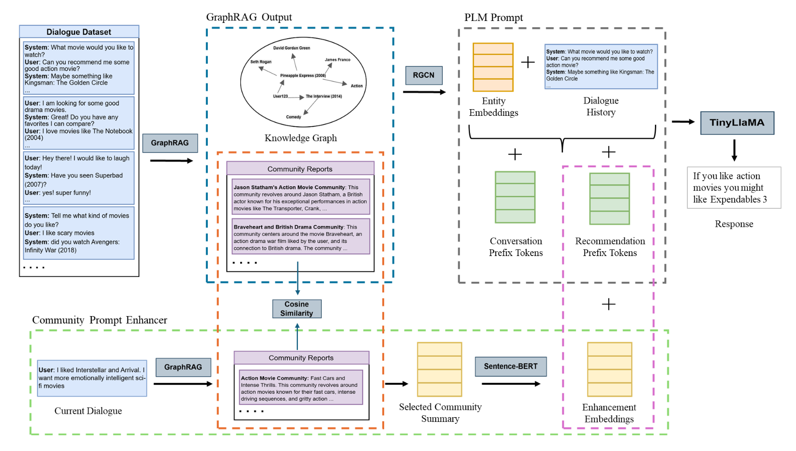

```{=html}
<main class="projects-page">
  <section class="projects-hero">
    <div class="projects-hero-copy">
      <p class="projects-kicker">Selected work</p>
      <h1>Projects that turn messy ideas into working systems.</h1>
      <p class="projects-hero-text">
        A curated mix of machine learning, data visualization, app development, and research publications.
      </p>
      <div class="projects-filter-row" aria-label="Project categories">
        <span>Machine Learning</span>
        <span>Data Visualization</span>
        <span>App Development</span>
        <span>Publications</span>
      </div>
    </div>
    <div class="projects-hero-panel" aria-label="Project highlights">
      <div>
        <strong>6</strong>
        <span>case studies + papers</span>
      </div>
      <div>
        <strong>4</strong>
        <span>disciplines</span>
      </div>
      <div>
        <strong>2023-2025</strong>
        <span>timeline</span>
      </div>
    </div>
  </section>

  <section class="featured-projects featured-projects-random" aria-label="Featured projects">
    <a class="featured-project compact is-active is-large" href="posts/machine_learning_projects/Longetivity_dataviz.html" data-featured-card>
      <div class="featured-media">
        
      </div>
      <div class="featured-copy">
        <div class="project-meta">
          <span>Data Viz</span>
          <span>Storytelling</span>
        </div>
        <h2>Global Life Expectancy DataViz</h2>
        <p>Interactive exploration of worldwide longevity patterns across regions and time.</p>
      </div>
    </a>

    <a class="featured-project compact is-active is-small" href="posts/machine_learning_projects/Elo_Kaggle.html" data-featured-card>
      <div class="featured-media">
        
      </div>
      <div class="featured-copy">
        <div class="project-meta">
          <span>Machine Learning</span>
          <span>Kaggle</span>
        </div>
        <h2>Kaggle: Elo Merchant Category Recommendation</h2>
        <p>Top 3.2% Kaggle solution using feature engineering, LightGBM, and outlier-aware blending.</p>
      </div>
    </a>

    <a class="featured-project compact is-active is-small" href="posts/publications/graphrag-crs.html" data-featured-card>
      <div class="featured-media">
        
      </div>
      <div class="featured-copy">
        <div class="project-meta">
          <span>Publication</span>
          <span>GraphRAG</span>
        </div>
        <h2>Knowledge-Grounded Conversational Recommendation</h2>
        <p>PRICAI paper on context-aware recommendation using graph retrieval and prompt learning.</p>
      </div>
    </a>

    <a class="featured-project compact" href="posts/publications/encoding-values.html" data-featured-card>
      <div class="featured-media">
        
      </div>
      <div class="featured-copy">
        <div class="project-meta">
          <span>Publication</span>
          <span>Responsible AI</span>
        </div>
        <h2>Encoding Values with Moral Frames</h2>
        <p>NeurIPS Creative AI Track paper on prompt-conditioned moral steering for generative AI.</p>
      </div>
    </a>

    <a class="featured-project compact" href="posts/machine_learning_projects/nndl.html" data-featured-card>
      <div class="featured-media">
        
      </div>
      <div class="featured-copy">
        <div class="project-meta">
          <span>Computer Vision</span>
          <span>TensorFlow</span>
        </div>
        <h2>Image-Based Gender and Age Classification</h2>
        <p>CNN and EfficientNet comparison for facial gender and age classification on Adience.</p>
      </div>
    </a>

    <a class="featured-project compact" href="posts/full_stack/mindful.html" data-featured-card>
      <div class="featured-media">
        
      </div>
      <div class="featured-copy">
        <div class="project-meta">
          <span>App Development</span>
          <span>Social Impact</span>
        </div>
        <h2>MindScope: Unconscious Bias</h2>
        <p>Application concept and build work for helping people reflect on unconscious bias.</p>
      </div>
    </a>
  </section>

  <section class="project-archive" aria-label="All projects">
    <div class="section-heading">
      <p class="projects-kicker">Archive</p>
      <h2>More builds and case studies</h2>
    </div>

    <div class="project-grid">
      <a class="archive-card" href="posts/machine_learning_projects/Elo_Kaggle.html">
        <div class="archive-card-top">
          <span class="archive-type">Machine Learning</span>
          <span class="archive-year">2025</span>
        </div>
        <h3>Kaggle: Elo Merchant Category Recommendation</h3>
        <p>Top 3.2% Kaggle solution using feature engineering, LightGBM, outlier-aware blending, and transaction behavior modeling.</p>
        <span class="archive-link">View project</span>
      </a>

      <a class="archive-card" href="posts/publications/graphrag-crs.html">
        <div class="archive-card-top">
          <span class="archive-type">Publication</span>
          <span class="archive-year">2025</span>
        </div>
        <h3>Context-Aware Knowledge-Grounded Conversational Recommendation</h3>
        <p>PRICAI 2025 paper on conversational recommendation with context awareness, knowledge grounding, and prompt learning.</p>
        <span class="archive-link">Read summary</span>
      </a>

      <a class="archive-card" href="posts/publications/encoding-values.html">
        <div class="archive-card-top">
          <span class="archive-type">Publication</span>
          <span class="archive-year">2025</span>
        </div>
        <h3>Encoding Values: Prompt-Conditioned Moral Frames</h3>
        <p>NeurIPS 2025 Creative AI Track paper on steering generative AI outputs through explicit moral framing.</p>
        <span class="archive-link">Read summary</span>
      </a>

      <a class="archive-card" href="posts/machine_learning_projects/nndl.html">
        <div class="archive-card-top">
          <span class="archive-type">Machine Learning</span>
          <span class="archive-year">2024</span>
        </div>
        <h3>Image-Based Gender and Age Classification</h3>
        <p>Computer vision case study comparing a baseline CNN, optimized CNN, and EfficientNet transfer learning on the Adience dataset.</p>
        <span class="archive-link">View project</span>
      </a>

      <a class="archive-card" href="posts/full_stack/mindful.html">
        <div class="archive-card-top">
          <span class="archive-type">App Development</span>
          <span class="archive-year">2023</span>
        </div>
        <h3>MindScope: Unconscious Bias</h3>
        <p>Application concept and build work for helping people identify and reduce unconscious bias.</p>
        <span class="archive-link">View project</span>
      </a>

    </div>
  </section>
</main>

<script>
  document.addEventListener('DOMContentLoaded', function(){
    var cards = Array.from(document.querySelectorAll('[data-featured-card]'));
    if (cards.length <= 3) return;

    cards.forEach(function(card){
      card.classList.remove('is-active', 'is-large', 'is-small');
    });

    for (var i = cards.length - 1; i > 0; i--) {
      var j = Math.floor(Math.random() * (i + 1));
      var temp = cards[i];
      cards[i] = cards[j];
      cards[j] = temp;
    }

    cards.slice(0, 3).forEach(function(card, index){
      card.classList.add('is-active');
      card.classList.add(index === 0 ? 'is-large' : 'is-small');
    });
  });
</script>
```
