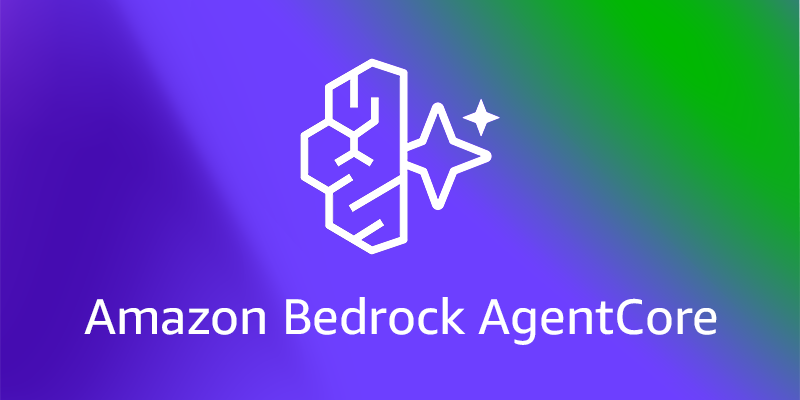
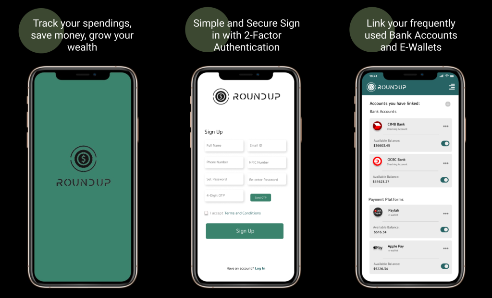

```{=html}
<main class="projects-page">
  <section class="projects-hero">
    <div class="projects-hero-copy">
      <p class="projects-kicker">Selected work</p>
      <h1>Projects that turn messy ideas into working systems.</h1>
      <p class="projects-hero-text">
        A curated mix of machine learning, data visualization, app development, and product design work.
      </p>
      <div class="projects-filter-row" aria-label="Project categories">
        <span>Machine Learning</span>
        <span>Data Visualization</span>
        <span>App Development</span>
        <span>UI/UX Design</span>
      </div>
    </div>
    <div class="projects-hero-panel" aria-label="Project highlights">
      <div>
        <strong>8</strong>
        <span>case studies</span>
      </div>
      <div>
        <strong>4</strong>
        <span>disciplines</span>
      </div>
      <div>
        <strong>2023-2025</strong>
        <span>timeline</span>
      </div>
    </div>
  </section>

  <section class="featured-projects" aria-label="Featured projects">
    <a class="featured-project featured-project-large" href="posts/machine_learning_projects/AgentCore.html">
      <div class="featured-media">
        
      </div>
      <div class="featured-copy">
        <div class="project-meta">
          <span>Agentic AI</span>
          <span>AWS</span>
        </div>
        <h2>Customer Support Agent with Amazon Bedrock AgentCore</h2>
        <p>Production-oriented support agent prototype with Strands, memory, tools, and AWS AgentCore workflows.</p>
      </div>
    </a>

    <div class="featured-stack">
      <a class="featured-project compact" href="posts/design_portfolio/round_up.html">
        <div class="featured-media">
          
        </div>
        <div class="featured-copy">
          <div class="project-meta">
            <span>UI/UX</span>
            <span>Fintech</span>
          </div>
          <h2>RoundUp Finance App</h2>
          <p>Mobile product design for passive saving and micro-investing through rounded-up purchases.</p>
        </div>
      </a>

      <a class="featured-project compact" href="posts/machine_learning_projects/Longetivity_dataviz.html">
        <div class="featured-media">
          
        </div>
        <div class="featured-copy">
          <div class="project-meta">
            <span>Data Viz</span>
            <span>Storytelling</span>
          </div>
          <h2>Global Life Expectancy DataViz</h2>
          <p>Interactive exploration of worldwide longevity patterns across regions and time.</p>
        </div>
      </a>
    </div>
  </section>

  <section class="project-archive" aria-label="All projects">
    <div class="section-heading">
      <p class="projects-kicker">Archive</p>
      <h2>More builds and case studies</h2>
    </div>

    <div class="project-grid">
      <a class="archive-card" href="posts/machine_learning_projects/Elo_Kaggle.html">
        <div class="archive-card-top">
          <span class="archive-type">Machine Learning</span>
          <span class="archive-year">2025</span>
        </div>
        <h3>Kaggle: Elo Merchant Category Recommendation</h3>
        <p>Predictive modeling work for customer loyalty and merchant recommendation signals.</p>
        <span class="archive-link">View project</span>
      </a>

      <a class="archive-card" href="posts/design_portfolio/c4t.html">
        <div class="archive-card-top">
          <span class="archive-type">UI/UX Design</span>
          <span class="archive-year">2025</span>
        </div>
        <h3>C4T Energy Mobile App</h3>
        <p>Mobile app interface work focused on clean flows for an energy-focused product experience.</p>
        <span class="archive-link">View design</span>
      </a>

      <a class="archive-card" href="posts/machine_learning_projects/nndl.html">
        <div class="archive-card-top">
          <span class="archive-type">Machine Learning</span>
          <span class="archive-year">2024</span>
        </div>
        <h3>Image-Based Gender Classification</h3>
        <p>Computer vision classification project exploring neural network training and model evaluation.</p>
        <span class="archive-link">View project</span>
      </a>

      <a class="archive-card" href="posts/full_stack/mindful.html">
        <div class="archive-card-top">
          <span class="archive-type">App Development</span>
          <span class="archive-year">2023</span>
        </div>
        <h3>MindScope: Unconscious Bias</h3>
        <p>Application concept and build work for helping people identify and reduce unconscious bias.</p>
        <span class="archive-link">View project</span>
      </a>

      <a class="archive-card" href="posts/design_portfolio/mindful.html">
        <div class="archive-card-top">
          <span class="archive-type">UI/UX Design</span>
          <span class="archive-year">2023</span>
        </div>
        <h3>MindScope Design Case Study</h3>
        <p>Design direction and interface thinking behind a bias-awareness mobile experience.</p>
        <span class="archive-link">View design</span>
      </a>
    </div>
  </section>
</main>
```
